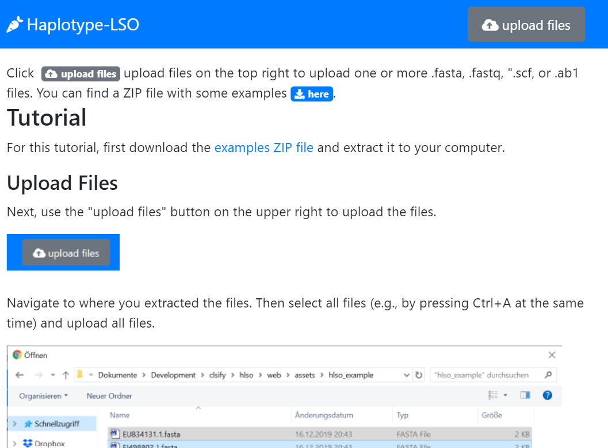

.. _manual-main:

=============
Haplotype-Lso
=============

Haplotype-Lso is a program for the automated determination of *C. liberibacter solanacearum*.
For the input, it takes capillary sequencing data from 16S, 16S-23S, and 50S locus enrichment.
It then performs a multi-locus sequence typing (MLST) following IPPC (International Plant Protection Convention) standard `DP 21: Candidatus Liberibacter solanacearum <https://www.ippc.int/en/publications/84157>`_.

    The Haplotype-Lso start page.

--------------
Public Web App
--------------

You can find the publically available version at https://haplotype-los.bihealth.org (hosting is provided by Core Unit Bioinformatics of the Berlin Institute of Health).
To get started, you can follow the :ref:`overview-tutorial`.

------------------------
Running on your Computer
------------------------

Haplotype-Lso has very low hardware requirements but depends on several external programs (e.g., NCBI BLAST) and must be run on a Linux computer.
The easiest way is to install it via Docker:

.. code-block:: shell

    $ docker run quay.io/biocontainers/haplotype-lso:<version>

    # for example:

    $ docker run quay.io/biocontainers/haplotype-lso:0.3.2--0

See `here <https://quay.io/repository/biocontainers/haplotype-lso?tab=tags>`_ for a list of all versions.

You can also install it via `Bioconda <https://bioconda.github.io>`_.
After installing Bioconda:

.. code-block:: shell

    $ conda install haplotype-lso

-------------------------
Source Code / Open Source
-------------------------

Haplotype-Lso is written in the Python programming language using Plotly Dash.
It is licensed under the permissive MIT license and you can find the source code in the `Github project <https://github.com/holtgrewe/haplotype-lso>`_.

.. toctree::
   :maxdepth: 1
   :caption: Overview
   :name: overview
   :hidden:
   :titlesonly:

   overview_tutorial
   overview_haplotyping
   overview_reference
   overview_cli

.. toctree::
   :maxdepth: 1
   :caption: Meta
   :name: meta
   :hidden:
   :titlesonly:

   meta_references

Indices and tables
==================

* :ref:`genindex`
* :ref:`search`
