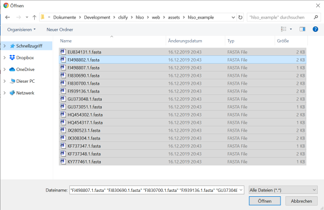
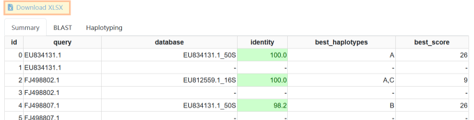
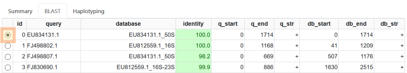
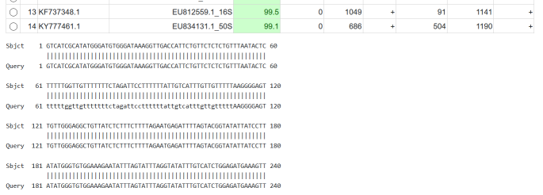
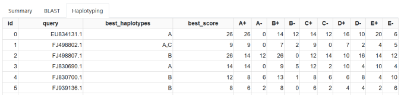

.. _overview-tutorial:

======================
Haplotype-Lso Tutorial
======================

For this tutorial, first download the `examples ZIP file <https://github.com/holtgrewe/haplotype-lso/blob/master/hlso/web/assets/hlso_example.zip?raw=true>`_ and extract it to your computer.

------------
Upload Files
------------

Next, use the "upload files" button on the upper right to upload the files.

Navigate to where you extracted the files.
Then select all files (e.g., by pressing :guilabel:`Ctrl + a` at the same time) and upload all files.

    Select the files you wan to upload (:guilabel:`Ctrl + a` to select all files).

Wait for a moment and the haplotyping results will be displayed.

------------------
Result Summary Tab
------------------

Note that you can download the results information also as an Excel file using the "Download XLSX" links on the top.

    Result summary tab.

The **Summary** tab shows the following information:

query
    the query file name

database
    the ID of the database sequence with the best match.
    The name will start with the GenBank identifier, followed by an underscore ``_`` and then the name of the region (currently one of 16S, 16S-23S, or 50S).

identity
    the identity of the BLAST match with the reference in percent.

best_haplotypes
    the best haplotypes based on the informative values on the reference.
    NB: if the sequencing error rate is high or the sequence is too short then not all informative positions will be covered.
    In this case, there can be ambiguity and more than one haplotype can be returned.
    For example, haplotypes A and C only differ in a single position on the 16S locus.

best_score
    the score of the best match used for haplotype identification.
    Concordance with a variant in the haplotyping table contributes a score of "plus one", discordance contributes a "minus one".
    The sum is the overall score.

----------------
Result BLAST Tab
----------------

    The BLAST result tab.

The **BLAST** tab provides the following information:

query, database, identity
    see above

q_start, q_end, q_str
    the start and end position of the match in the query and its strand

db_start, db_end, db_start
    the start end end position of the match in the database and its strand

Further, you can select each match with the little round button on the right.
The corresponding BLAST match will be displayed below the results table.

------------------
Result Haplotyping
------------------

    The haplotyping result tab.

The **Haplotyping** tab shows more details on the haplotyping results.

query
    see above

best_haplotypes
    the best haplotype(s) for the given query

best_score
    the best score of the best haplotype(s)

A+, A-, etc.
    for each haplotype known to Haplotype-LSO, the number of positive/concordant and negative/discordant position
